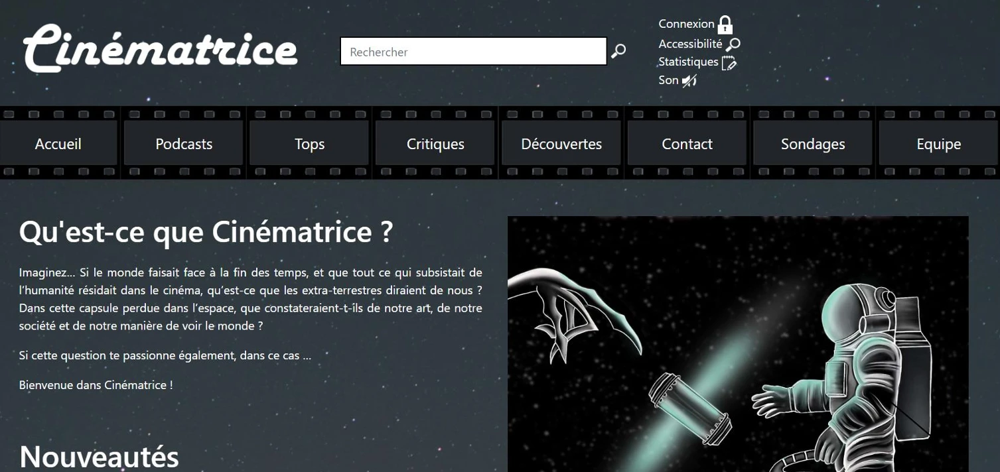

# Cinématrice

Site web du podcast **Cinématrice** — critiques, découvertes et podcasts cinéma, avec un CMS pour gérer le contenu.

Projet en PHP pur (sans framework) avec une base de données MySQL, initialement hébergé chez Infomaniak.



## Prérequis

- **XAMPP** (Apache + MySQL/MariaDB + PHP + phpMyAdmin) — [apachefriends.org](https://www.apachefriends.org/)
- **Git**

## Installation en local

### 1. Cloner le projet

Placez-vous dans le dossier `htdocs` de XAMPP et clonez le repo :

```bash
cd C:\xampp\htdocs
git clone https://github.com/Matthjass13/Cinematrice.git cinematrice
```

### 2. Démarrer les services

Ouvrez le **XAMPP Control Panel** et démarrez :
- **Apache**
- **MySQL**

### 3. Créer la base de données

Ouvrez [http://localhost/phpmyadmin](http://localhost/phpmyadmin) et créez une base nommée `3b2wc_cinematrice` (même nom que dans `modele/modele.php`, pour éviter d'avoir à le changer).

Sélectionnez cette base, allez dans l'onglet **SQL**, puis collez et exécutez ce script :

```sql
CREATE TABLE tblgenres (
  IdGenre INT(11) AUTO_INCREMENT PRIMARY KEY,
  Genre VARCHAR(50)
);

CREATE TABLE tbltypes (
  IdType INT(11) AUTO_INCREMENT PRIMARY KEY,
  Type VARCHAR(50)
);

CREATE TABLE tblreals (
  IdReal INT(11) AUTO_INCREMENT PRIMARY KEY,
  Nom VARCHAR(50),
  Prenom VARCHAR(50),
  Photo VARCHAR(200)
);

CREATE TABLE tblusers (
  IdUser INT(11) AUTO_INCREMENT PRIMARY KEY,
  User VARCHAR(50),
  MotDePasse VARCHAR(500)
);

CREATE TABLE tblfilms (
  IdFilm INT(11) AUTO_INCREMENT PRIMARY KEY,
  Titre VARCHAR(50),
  Annee YEAR(4),
  Pitch VARCHAR(1000),
  Duree TIME,
  Affiche VARCHAR(200),
  IdGenre INT(11),
  IdType INT(11),
  IdReal INT(11),
  FOREIGN KEY (IdGenre) REFERENCES tblgenres(IdGenre),
  FOREIGN KEY (IdType) REFERENCES tbltypes(IdType),
  FOREIGN KEY (IdReal) REFERENCES tblreals(IdReal)
);

CREATE TABLE tblpodcasts (
  IdPodcast INT(11) AUTO_INCREMENT PRIMARY KEY,
  Theme VARCHAR(50),
  Description VARCHAR(500),
  Video1 VARCHAR(50),
  Video2 VARCHAR(50),
  Video3 VARCHAR(50),
  IdFilm1 INT(11),
  IdFilm2 INT(11),
  IdFilm3 INT(11),
  Episode INT(11),
  FOREIGN KEY (IdFilm1) REFERENCES tblfilms(IdFilm),
  FOREIGN KEY (IdFilm2) REFERENCES tblfilms(IdFilm),
  FOREIGN KEY (IdFilm3) REFERENCES tblfilms(IdFilm)
);

CREATE TABLE tbldecouvertes (
  IdDecouverte INT(11) AUTO_INCREMENT PRIMARY KEY,
  Decouverte VARCHAR(1000),
  IdFilm INT(11),
  IdUser INT(11),
  FOREIGN KEY (IdFilm) REFERENCES tblfilms(IdFilm),
  FOREIGN KEY (IdUser) REFERENCES tblusers(IdUser)
);

CREATE TABLE tblcritiques (
  IdCritique INT(11) AUTO_INCREMENT PRIMARY KEY,
  Critique VARCHAR(10000),
  Note TINYINT(4),
  IdFilm INT(11),
  IdUser INT(11),
  FOREIGN KEY (IdFilm) REFERENCES tblfilms(IdFilm),
  FOREIGN KEY (IdUser) REFERENCES tblusers(IdUser)
);

-- Genre 9 et Réal 10 = "Inconnu" (valeurs par défaut attendues dans addFilm(), modele.php)
INSERT INTO tblgenres (Genre) VALUES ('Action'),('Drame'),('Comédie'),('Horreur'),('Science-fiction'),('Animation'),('Thriller'),('Documentaire'),('Inconnu');
INSERT INTO tblreals (Nom, Prenom) VALUES ('Nom1','Prenom1'),('Nom2','Prenom2'),('Nom3','Prenom3'),('Nom4','Prenom4'),('Nom5','Prenom5'),('Nom6','Prenom6'),('Nom7','Prenom7'),('Nom8','Prenom8'),('Nom9','Prenom9'),('Inconnu','Inconnu');
INSERT INTO tbltypes (Type) VALUES ('Film'),('Série'),('Court-métrage');
```

### 4. Créer un compte admin (pour accéder au CMS)

Le mot de passe est vérifié via `password_verify()` : il faut donc insérer un **hash**, pas le mot de passe en clair.

Générez le hash avec PHP (fourni par XAMPP) :

```bash
C:\xampp\php\php.exe -r "echo password_hash('votreMotDePasse', PASSWORD_DEFAULT);"
```

Copiez le hash affiché, puis dans l'onglet **SQL** de phpMyAdmin :

```sql
INSERT INTO tblusers (User, MotDePasse) VALUES ('admin', 'COLLEZ_LE_HASH_ICI');
```

Vous vous connecterez ensuite sur le site avec `admin` / `votreMotDePasse` (le mot de passe en clair).

### 5. Configurer la connexion à la base

Dans `modele/modele.php`, adaptez les identifiants de connexion pour votre environnement local :

```php
function connect_bd() {
  $servername = "localhost";
  $username = "root";
  $password = "";          // mot de passe vide par défaut avec XAMPP
  $bdd = "3b2wc_cinematrice";
  ...
```

⚠️ Ne commitez pas de vrais identifiants de production dans ce fichier.

### 6. Lancer le site

Ouvrez :

```
http://localhost/cinematrice/
```

## Dépannage

**Erreur 500 "Internal Server Error"**
Vérifiez `C:\xampp\apache\logs\error.log`. Si vous voyez une erreur du type `Invalid command 'AddOutputFilterByType'`, les modules Apache `mod_deflate`/`mod_filter` requis par le `.htaccess` ne sont pas activés. Dans `C:\xampp\apache\conf\httpd.conf`, décommentez :

```apache
LoadModule deflate_module modules/mod_deflate.so
LoadModule filter_module modules/mod_filter.so
```

Puis redémarrez Apache depuis le XAMPP Control Panel.
